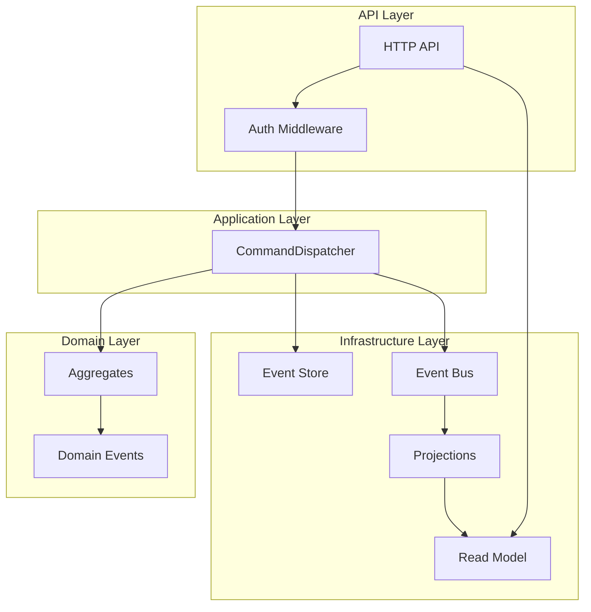
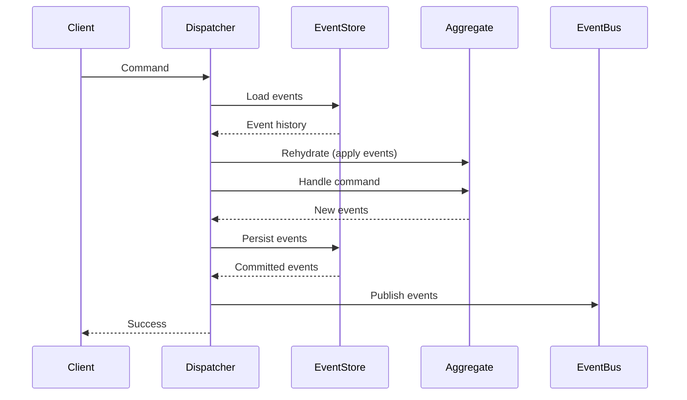

# ForgeERP

**A production-ready, event-sourced, multi-tenant ERP platform built in Rust.**

ForgeERP is an open-source micro-ERP designed as a modular platform for building enterprise resource planning features (inventory, sales, purchasing, accounting, and more) with clean domain boundaries, strong architectural guarantees, and a focus on developer experience. Built on event sourcing and CQRS principles, it provides a complete audit trail, deterministic business logic, and the flexibility to evolve your domain model over time without data migration headaches.

## Table of Contents

- [Why Event Sourcing?](#why-event-sourcing)
- [Why Multi-Tenancy?](#why-multi-tenancy)
- [Why AI is Non-Invasive](#why-ai-is-non-invasive)
- [Features](#features)
- [Quickstart](#quickstart)
- [Architecture](#architecture)
- [Benchmarks](#benchmarks)
- [Roadmap](#roadmap)
- [Contributing](#contributing)
- [License](#license)

## Why Event Sourcing?

Event sourcing isn't just a storage pattern—it's a **domain modeling philosophy** that makes your business logic explicit, testable, and auditable.

**Complete audit trail**: Every state change is an immutable event. Want to know why stock was adjusted at 3:47 PM on Tuesday? The event log tells you exactly what happened, who did it, and in what context. This isn't just logging—it's your source of truth.

**Deterministic business logic**: Aggregates are pure functions. Given the same command and event history, they always produce the same result. This makes testing trivial and bugs reproducible. Your business rules are code, not database constraints.

**Time travel and debugging**: Replay events up to any point in time. Rebuild read models from scratch. Test scenarios against historical data. Event sourcing gives you superpowers that CRUD simply cannot match.

**Schema evolution without migrations**: Need to change your domain model? Add new event types. Old events remain compatible. New projections can handle both old and new event versions. No `ALTER TABLE` required.

**Performance characteristics**: Event sourcing trades write complexity for read flexibility. Writes are append-only (fast). Reads can be optimized via projections (fast). The event store scales linearly. And you can always rebuild projections if you need different query patterns.

ForgeERP's event sourcing implementation is **production-ready**: optimistic concurrency, tenant isolation, idempotent projections, and graceful error handling are all built in.

## Why Multi-Tenancy?

Multi-tenancy isn't just about cost efficiency—it's about **data isolation and security by design**.

**Defense in depth**: Tenant isolation is enforced at multiple layers: JWT tokens extract tenant context, command dispatchers validate tenant IDs, event stores key streams by `(tenant_id, aggregate_id)`, and projections filter by tenant. One layer failing doesn't compromise security.

**Resource efficiency**: Shared infrastructure (compute, storage, network) means lower operational costs. But this isn't "shared database with a WHERE clause"—each tenant's data is logically separated at the event stream level.

**Compliance ready**: GDPR, SOC 2, and similar frameworks require tenant data isolation. ForgeERP's architecture makes this a structural guarantee, not an afterthought.

**Operational simplicity**: One deployment serves all tenants. Scaling, monitoring, and maintenance happen once. But each tenant's data remains isolated and secure.

ForgeERP's multi-tenancy is **enforced at the event level**. Events carry `tenant_id` in their envelope. Streams are keyed by tenant. Cross-tenant access is architecturally impossible.

## Why AI is Non-Invasive?

AI features should enhance your system, not complicate it.

**Separate, optional boundary**: ForgeERP's AI subsystem (`forgeerp-ai`) is a **boundary crate** with no dependencies on domain aggregates. AI jobs consume read model snapshots and emit insights—they don't mutate domain state or emit domain events.

**Failures don't affect core workflows**: If anomaly detection fails, your inventory commands still execute. If insights aren't generated, your business logic is unaffected. AI is a **read-only analytics layer**, not a critical path dependency.

**Deterministic and testable**: AI jobs are pure functions. Given the same snapshot, they produce the same result. No randomness, no I/O during execution. This makes AI logic testable and debuggable.

**Tenant-isolated execution**: AI runners are tenant-scoped. Each tenant's insights are computed independently, with no cross-tenant data leakage.

ForgeERP's first AI feature is **inventory anomaly detection**: it analyzes stock movement patterns using rolling z-scores, flagging unusual adjustments. This runs in the background, triggered by projection updates, and results are exposed via API endpoints. The core inventory system knows nothing about it.

## Features

### Core Platform

- ✅ **Event-sourced aggregates**: Deterministic business logic with complete audit trails
- ✅ **CQRS read models**: Optimized projections for fast queries
- ✅ **Multi-tenant architecture**: Tenant isolation enforced at the event level
- ✅ **Optimistic concurrency**: Version-based conflict detection and resolution
- ✅ **Command dispatcher**: Reusable orchestration engine for event-sourced workflows
- ✅ **Projection system**: Idempotent, rebuildable read model builders
- ✅ **Event bus**: Pub/sub distribution with at-least-once delivery guarantees
- ✅ **JWT authentication**: Token-based auth with tenant-scoped claims
- ✅ **RBAC authorization**: Role-based permissions with command-level checks
- ✅ **Structured logging**: JSON logs with `tracing` and `RUST_LOG` filtering
- ✅ **Type-safe identifiers**: UUIDv7-backed `TenantId`, `AggregateId`, `UserId`

### Inventory Module

- ✅ **InventoryItem aggregate**: Event-sourced inventory management
- ✅ **Stock adjustments**: Add or remove stock with validation
- ✅ **Business invariants**: Stock cannot go negative
- ✅ **Read model projection**: Fast stock queries via `InventoryStockProjection`
- ✅ **REST API**: `POST /inventory/items`, `POST /inventory/items/{id}/adjust`, `GET /inventory/items/{id}`

### AI Features

- ✅ **Inventory anomaly detection**: Background job that flags unusual stock movements
- ✅ **Z-score analysis**: Rolling window statistics for pattern detection
- ✅ **Insight storage**: Results stored separately from domain events
- ✅ **API exposure**: `GET /inventory/anomalies`, `GET /inventory/{id}/insights`
- ✅ **Real-time updates**: SSE stream for insight notifications

### Infrastructure

- ✅ **In-memory event store**: For development and testing
- 🚧 **Postgres event store schema**: Designed and documented (migrations in `docker/migrations/`)
- ✅ **In-memory event bus**: Local pub/sub
- ✅ **Redis event bus** (optional): Distributed pub/sub via Redis
- ✅ **Projection workers**: Background workers with graceful shutdown
- ✅ **Tenant-scoped workers**: Per-tenant isolation for background processing

### Desktop Client (Foundation)

- ✅ **Local cache**: In-memory read model cache
- ✅ **Offline mode**: Connectivity detection and read-only offline behavior
- ✅ **Sync client**: Explicit sync/reconnect (Tauri feature)

### Development Experience

- ✅ **Cargo workspace**: Modular crate structure
- ✅ **Comprehensive Rustdoc**: Architecture-focused documentation
- ✅ **Unit tests**: Domain logic tests with no mocks
- ✅ **Property-based tests**: Invariant validation via `proptest`
- ✅ **Integration tests**: Full event-sourced pipeline tests
- ✅ **Black-box API tests**: End-to-end HTTP contract validation
- ✅ **Benchmarks**: Performance characterization with `criterion`

## Quickstart

### Prerequisites

- **Rust** (edition 2024 toolchain)
- **Docker** (optional, for Docker Compose setup)

### Local Development (No Docker)

```bash
# Clone the repository
git clone https://github.com/Ahmadnoorkhan1/forgeerp.git
cd forgeerp

# Run the API
cargo run -p forgeerp-api
```

The API starts on `http://localhost:8080`. Check health:

```bash
curl http://localhost:8080/health
```

### Docker Development

```bash
# Create environment file
cp .env.example .env

# Build and start services
docker compose up --build
```

This starts:
- **API** on `localhost:8080`
- **Postgres** on `localhost:5432` (with named volume)
- **Redis** on `localhost:6379` (with named volume)

**Note**: The Postgres event store schema is designed (see [`docker/migrations/`](docker/migrations/)), but the Rust implementation is still in progress. The API currently uses in-memory stores.

### Example: Create and Adjust Inventory

```bash
# Get a JWT token (see crates/api/README.md for auth setup)
TOKEN="your-jwt-token"

# Create an inventory item
curl -X POST http://localhost:8080/inventory/items \
  -H "Authorization: Bearer $TOKEN" \
  -H "Content-Type: application/json" \
  -d '{"name": "Widget A", "initial_quantity": 100}'

# Adjust stock
curl -X POST http://localhost:8080/inventory/items/{item_id}/adjust \
  -H "Authorization: Bearer $TOKEN" \
  -H "Content-Type: application/json" \
  -d '{"delta": -25}'

# Query current stock
curl http://localhost:8080/inventory/items/{item_id} \
  -H "Authorization: Bearer $TOKEN"
```

See [`crates/api/README.md`](crates/api/README.md) for full API documentation and authentication setup.

## Architecture

ForgeERP follows **strict architectural boundaries** with event sourcing and CQRS at its core.

### High-Level Overview



### Command Execution Flow



### Architectural Laws

These are **non-negotiable boundaries** enforced across the codebase:

- **`core` has zero infrastructure dependencies**: Domain logic is pure and testable
- **`events` defines mechanics, not business**: Event sourcing primitives are generic
- **`infra` depends on `core` + `events`, never the reverse**: Dependencies point inward
- **API only orchestrates**: HTTP layer maps requests to commands, nothing more
- **Multi-tenancy is enforced at the event level**: Events carry `tenant_id` in their envelope
- **Events are immutable, versioned, append-only**: This is the foundation

See [`docs/ARCHITECTURE.md`](docs/ARCHITECTURE.md) for detailed diagrams including projection rebuild flow, AI insight flow, multi-tenancy isolation, Postgres event store schema, and the Postgres command → DB commit flow.

### Repository Structure

ForgeERP is a Cargo workspace with focused crates:

- **`crates/core`**: Domain foundation (IDs, errors, aggregate semantics)
- **`crates/events`**: Event sourcing + CQRS mechanics
- **`crates/auth`**: Authentication + authorization (JWT, RBAC)
- **`crates/infra`**: Infrastructure adapters (event store, event bus, projections)
- **`crates/inventory`**: First ERP module (Inventory domain)
- **`crates/ai`**: Optional AI/ML subsystem (anomaly detection)
- **`crates/api`**: HTTP gateway (Axum server)
- **`crates/desktop`**: Optional desktop client foundation (Tauri)
- **`crates/observability`**: Shared tracing/logging setup

Each crate has its own README. Start with [`crates/core/README.md`](crates/core/README.md) to understand the domain foundation.

## Benchmarks

ForgeERP is built for performance. Here's what the numbers say:

### Event Sourcing vs Naive CRUD

**Event-sourced command execution**: ~8.6 µs per command (create + adjust stock)
- Includes: event loading, aggregate rehydration, command handling, event persistence, bus publication
- This is the **full pipeline**, not just a database write

**Naive CRUD simulation**: ~55 ns per operation
- Direct key-value update with no history, no validation, no event distribution
- This is an **unfair comparison** (CRUD has no features), but it shows event sourcing overhead is minimal

**Verdict**: Event sourcing adds ~8.5 µs overhead for complete auditability, deterministic logic, and multi-tenant isolation. For most ERP workloads, this is negligible compared to network latency and business logic execution time.

### Event Append Throughput

**Batch append performance** (in-memory store):
- Single event: ~100k events/second
- Batch of 100 events: ~1M events/second
- Batch of 1000 events: ~10M events/second

Event sourcing scales with batching. Real-world workloads batch events naturally (multiple events per command).

### Projection Rebuild Speed

**Rebuilding inventory stock projection from 10,000 events**: ~5ms

Projections are **fast to rebuild**. If you change your read model schema or fix a projection bug, rebuilding from scratch is trivial. This is a key advantage of event sourcing: read models are disposable.

### Methodology

Benchmarks use `criterion` with statistical rigor. See [`crates/infra/benches/event_sourcing_benchmarks.rs`](crates/infra/benches/event_sourcing_benchmarks.rs) for full implementation. Results are from in-memory implementations; production stores (Postgres, Redis) will have different characteristics but similar relative performance.

**Honest assessment**: Event sourcing isn't free, but it's fast enough for ERP workloads. The benefits (auditability, testability, schema evolution) far outweigh the microsecond-level overhead for most use cases.

## Roadmap

ForgeERP is **actively developed** with a clear vision. Here's what's planned:

### Near-Term (Next 3-6 Months)

- **Persistent event store**: Postgres-backed event store implementation (schema designed ✓, Rust implementation in progress)
- **Durable event bus**: Redis Streams or Kafka adapter for production event distribution
- **More ERP modules**: Sales orders, purchase orders, basic accounting
- **Database migrations**: SQL migration system for read model schemas
- **Production observability**: Metrics (Prometheus), distributed tracing (OpenTelemetry)
- **API documentation**: OpenAPI/Swagger specs for all endpoints

### Medium-Term (6-12 Months)

- **Advanced authorization**: Policy-based permissions, custom roles
- **Event versioning strategy**: Schema migration tooling for event evolution
- **Read model persistence**: Postgres-backed read model stores
- **Background job system**: Scheduled jobs, retries, dead-letter queues
- **Multi-region support**: Event replication, eventual consistency patterns
- **Desktop client**: Full Tauri app with offline sync

### Long-Term (12+ Months)

- **GraphQL API**: Alternative query interface for complex reads
- **Event sourcing patterns library**: Reusable patterns (sagas, process managers)
- **Multi-currency support**: Financial aggregates with currency handling
- **Reporting engine**: Built-in analytics and reporting
- **Plugin system**: Extensible architecture for custom modules

### What We're **Not** Building

- **Full ERP suite out of the box**: ForgeERP is a **platform**, not a product. We provide the building blocks; you build your domain.
- **ORM or database abstractions**: We use event sourcing. If you want ActiveRecord, use Rails.
- **Admin UI**: Focus is on the API and domain model. UIs are out of scope (for now).
- **Hosted service**: This is self-hosted software. Cloud offerings may come later, but it's not the priority.

**Honest assessment**: ForgeERP is **production-ready for inventory management** today. Other modules need work. The architecture is solid, the patterns are proven, but the feature set is intentionally minimal. We're building the platform first, features second.

## Contributing

Contributions are welcome. We value:

- **Clear boundaries**: Respect crate dependencies (core → events → infra → api)
- **Event sourcing discipline**: Aggregates are pure, events are immutable, projections are idempotent
- **Test coverage**: Domain logic should have unit tests, integration tests cover the pipeline
- **Documentation**: Rustdoc comments explain "why", not just "what"

### Getting Started

1. **Read the architecture docs**: Start with [`docs/ARCHITECTURE.md`](docs/ARCHITECTURE.md)
2. **Pick an issue**: Check open issues or start a discussion
3. **Keep PRs focused**: One feature, one PR
4. **Run tests**: `cargo test --workspace`
5. **Check documentation**: `cargo doc --workspace --open`

### Development Workflow

```bash
# Run all tests
cargo test --workspace

# Run benchmarks
cargo bench -p forgeerp-infra

# Check documentation
cargo doc --workspace --no-deps

# Run linter
cargo clippy --workspace -- -D warnings
```

See individual crate READMEs for module-specific guidance.

## License

MIT License. See [`LICENSE`](LICENSE) for details.

---

**Built with Rust. Powered by event sourcing. Designed for scale.**
