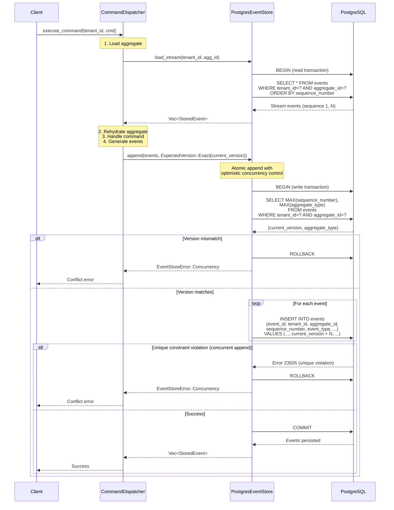

# Postgres Event Store: Command → DB Commit Flow

## Mermaid Diagram

## Key Points

1. **Tenant Isolation**: Every query includes `tenant_id` in the WHERE clause, making cross-tenant access impossible.

2. **Optimistic Concurrency**: 
   - Version check happens within a transaction
   - Unique constraint on `(tenant_id, aggregate_id, sequence_number)` prevents concurrent inserts
   - If two transactions try to append simultaneously, one will fail with a unique constraint violation

3. **Atomicity**: All events in a batch are inserted within a single transaction (all-or-nothing).

4. **Tracing**: All database operations are instrumented with tracing spans for observability.

