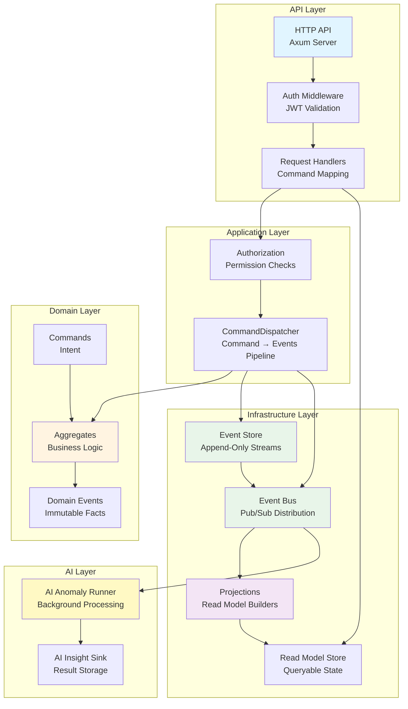
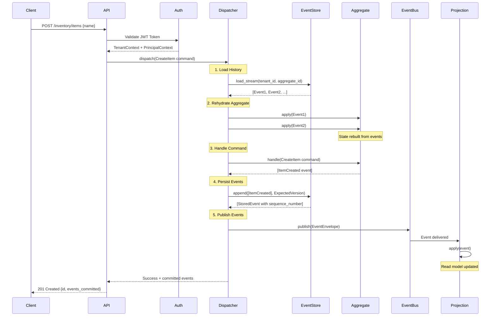
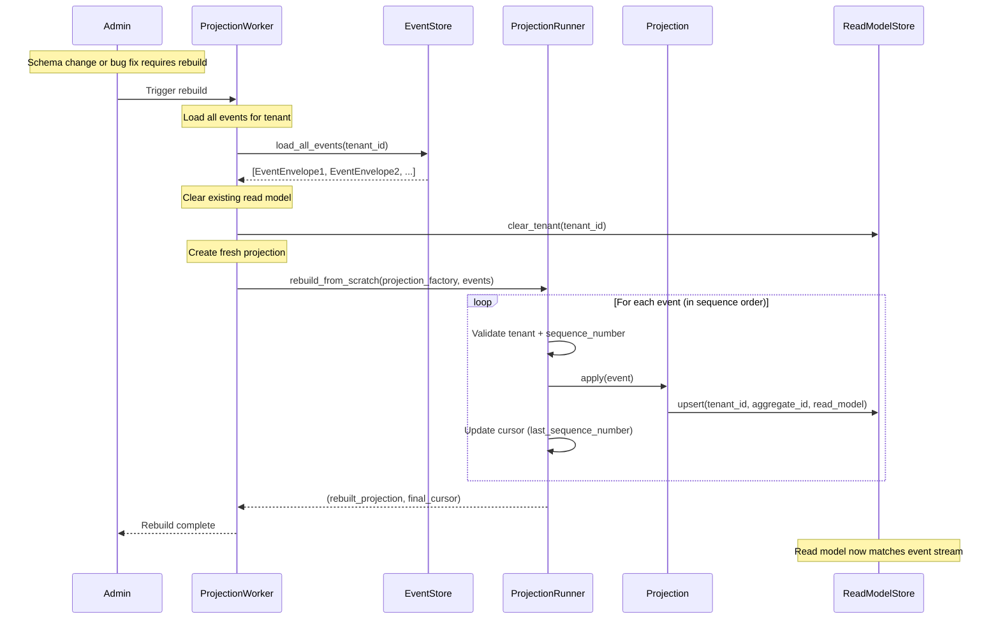
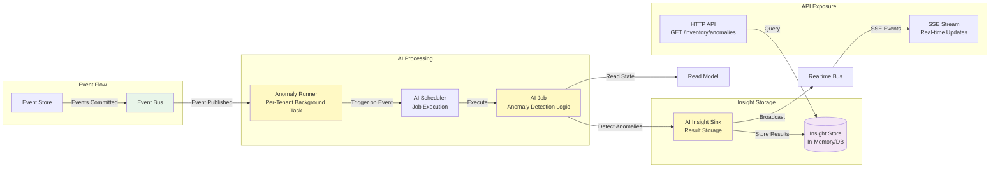
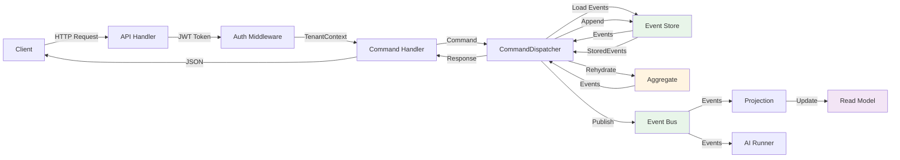
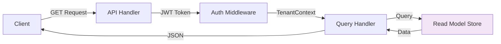
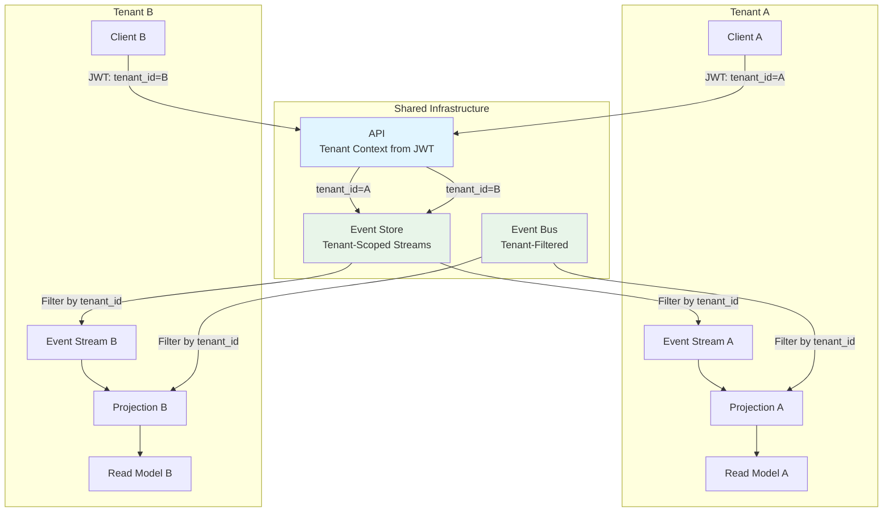
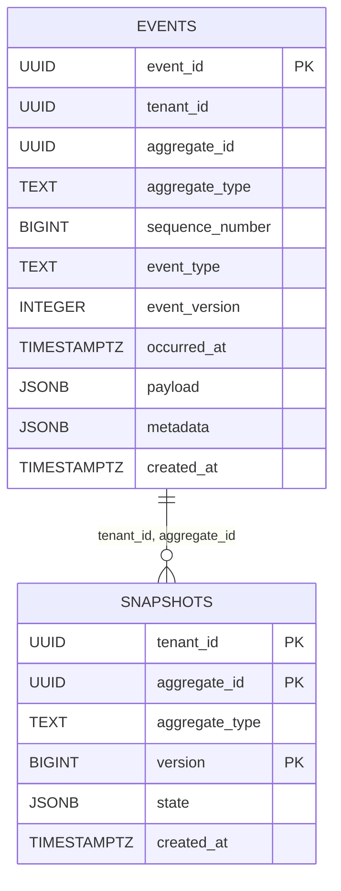

# ForgeERP Architecture

This document provides visual architecture diagrams for understanding ForgeERP's event-sourced, multi-tenant ERP system.

## High-Level Architecture



**Key Components:**
- **API Layer**: HTTP endpoints, authentication, request/response mapping
- **Application Layer**: Command orchestration, authorization
- **Domain Layer**: Pure business logic, aggregates, events, commands
- **Infrastructure Layer**: Event persistence, distribution, read model building
- **AI Layer**: Background anomaly detection and insights

## Command Execution Flow



**Flow Steps:**
1. **Load**: Retrieve all events for the aggregate from event store
2. **Rehydrate**: Apply historical events to rebuild aggregate state
3. **Handle**: Execute command logic (pure, no mutation) → produces events
4. **Persist**: Append events to event store with optimistic concurrency check
5. **Publish**: Publish committed events to event bus for downstream consumers

## Projection Rebuild Flow



**Rebuild Process:**
1. **Load Events**: Retrieve all events for the tenant/aggregate from event store
2. **Clear Read Model**: Remove existing read model data (disposable)
3. **Replay Events**: Process events in sequence number order through projection
4. **Update Read Model**: Projection updates read model store for each event
5. **Track Progress**: Cursor tracks last processed sequence number

**When to Rebuild:**
- Schema changes in read model
- Bug fixes in projection logic
- Disaster recovery (rebuilding from backup)
- Testing projections with full event history

## AI Insight Flow



**AI Flow Steps:**
1. **Event Trigger**: Events published to event bus trigger AI processing
2. **Background Runner**: Per-tenant anomaly runner processes events asynchronously
3. **Anomaly Detection**: AI job analyzes read model state and detects anomalies
4. **Result Storage**: Insights stored in AI sink (results + metadata)
5. **API Exposure**: Insights queryable via HTTP API and real-time SSE streams

**Non-Authoritative Note:**
AI insights are **non-authoritative** - they don't affect core business logic. Failures in AI processing don't impact command execution or event persistence. AI is a separate, optional layer for analytics and anomaly detection.

## Data Flow: Write Path



## Data Flow: Read Path



**Read Path:**
- Queries go directly to read model (no event replay)
- Fast, optimized for query performance
- Tenant-scoped queries automatically filtered

## Multi-Tenancy Isolation



**Isolation Mechanisms:**
- **JWT Token**: Tenant ID extracted from token claims
- **Event Store**: Streams keyed by `(tenant_id, aggregate_id)`
- **Command Dispatcher**: Validates tenant_id on all operations
- **Projections**: Filter events by tenant_id
- **Read Models**: Scoped queries by tenant_id
- **Defense in Depth**: Multiple validation layers prevent cross-tenant access

## Event Store Schema

ForgeERP uses a Postgres-backed event store for production deployments. The schema is designed for append-only event storage with tenant isolation and efficient querying.

### Database Schema



**Events Table (`events`)**:
- **Purpose**: Append-only storage for all domain events
- **Primary Key**: `event_id` (UUID)
- **Unique Constraint**: `(tenant_id, aggregate_id, sequence_number)` - ensures no duplicate sequence numbers per stream
- **Indexes**: 
  - Stream queries: `(tenant_id, aggregate_id, sequence_number)`
  - Tenant-wide queries: `(tenant_id, created_at)`
  - Time-based queries: `(occurred_at DESC)`
  - Metadata searches: GIN index on `metadata` JSONB
- **Constraints**: 
  - `sequence_number > 0` (invalidates sequence 0)
  - Append-only enforcement via triggers (prevents UPDATE/DELETE)

**Snapshots Table (`snapshots`)**:
- **Purpose**: Optional aggregate state snapshots for fast rehydration
- **Primary Key**: `(tenant_id, aggregate_id, version)`
- **Indexes**:
  - Latest snapshot: `(tenant_id, aggregate_id, version DESC)`
  - Cleanup: `(tenant_id, aggregate_id, created_at DESC)`
- **Policy**: Snapshots are optional optimizations; system works without them by replaying all events

### Snapshot Policy

Snapshots are created to optimize aggregate rehydration for aggregates with long event histories:

**When to Snapshot**:
- Every N events (e.g., every 100 events per aggregate)
- Time-based (e.g., every hour for active aggregates)
- On-demand (before major migrations, aggregate rebuilds)
- Selective (only for aggregates with > threshold events)

**Snapshot Strategy**:
- **Frequency**: Balance storage cost vs. rehydration speed
- **Retention**: Keep latest N snapshots per aggregate (e.g., latest 5)
- **Cleanup**: Periodically purge old snapshots (they're disposable)
- **Failure Tolerance**: If snapshot creation fails, replay all events (slower but correct)

**Rehydration Pattern**:
1. Load latest snapshot with `version <= target_version`
2. If snapshot exists, load events with `sequence_number > snapshot.version`
3. If no snapshot, load all events
4. Apply snapshot state + events to rebuild aggregate

### Event Store Layout

```mermaid
graph TB
    subgraph "Event Stream"
        direction LR
        E1[Event<br/>seq: 1<br/>ItemCreated]
        E2[Event<br/>seq: 2<br/>StockAdjusted]
        E3[Event<br/>seq: 3<br/>StockAdjusted]
        E4[Event<br/>seq: 4<br/>StockAdjusted]
        E100[Event<br/>seq: 100<br/>StockAdjusted]
        E101[Event<br/>seq: 101<br/>StockAdjusted]
        
        E1 --> E2 --> E3 --> E4
        E4 -.->|...| E100 --> E101
        
        SNAP[Snapshot<br/>version: 100<br/>state: {...}]
        
        E100 -.->|snapshot<br/>created| SNAP
        SNAP -.->|load events<br/>after| E101
    end
    
    subgraph "Stream Key"
        TENANT[tenant_id]
        AGG[aggregate_id]
        TENANT --> AGG
    end
    
    style SNAP fill:#fff9c4
    style E1 fill:#e8f5e9
    style E100 fill:#e8f5e9
```

### Query Patterns

**Load Stream** (CommandDispatcher):
```sql
SELECT * FROM events 
WHERE tenant_id = ? AND aggregate_id = ?
ORDER BY sequence_number ASC;
```

**Latest Snapshot**:
```sql
SELECT * FROM snapshots
WHERE tenant_id = ? AND aggregate_id = ?
ORDER BY version DESC LIMIT 1;
```

**Tenant-Wide Replay** (Projection Rebuild):
```sql
SELECT * FROM events
WHERE tenant_id = ?
ORDER BY tenant_id, aggregate_id, sequence_number ASC;
```

**Time-Based Queries**:
```sql
SELECT * FROM events
WHERE tenant_id = ? AND occurred_at >= ? AND occurred_at < ?
ORDER BY occurred_at ASC;
```

### UUIDv7 Compatibility

All UUID columns use standard Postgres UUID type. UUIDv7 generation happens in application code (Rust's `uuid` crate), providing time-ordering benefits:
- Better index locality (recent events clustered)
- Natural ordering by creation time
- Efficient time-based queries

### Row-Level Security (Optional)

RLS policies provide database-level tenant isolation as additional defense-in-depth:
- Policies restrict access to events/snapshots matching `current_tenant_id()`
- Application must set `app.current_tenant_id` session variable
- Optional - application-level filtering is sufficient for most use cases

See [`docker/migrations/003_create_rls_policies.sql`](../docker/migrations/003_create_rls_policies.sql) for implementation.

### Performance Characteristics

- **Append Operations**: O(1) with proper indexes (very fast)
- **Stream Loads**: O(log n) using stream index (efficient even for long streams)
- **Snapshot Queries**: O(log n) for latest snapshot lookup
- **Tenant-Wide Queries**: Efficient with tenant index (supports projection replay)

The schema is optimized for the primary use case: loading event streams for command execution. Secondary use cases (tenant-wide replay, time-based queries) are supported with additional indexes.

