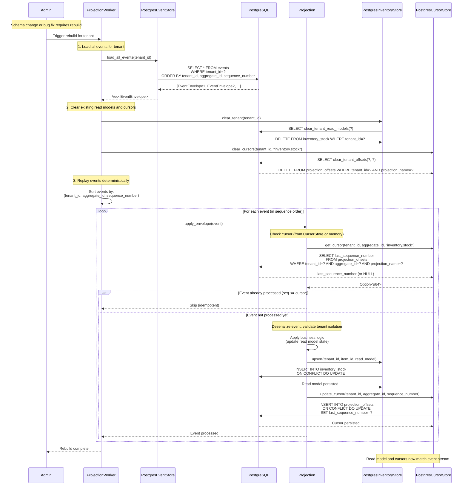

# Projection Rebuild Flow

## Mermaid Diagram

## Key Points

1. **Deterministic Rebuilds**: Events are sorted by `(tenant_id, aggregate_id, sequence_number)` before replay, ensuring deterministic ordering regardless of event store query order.

2. **Drop-and-Rebuild Safe**: The rebuild process:
   - Clears all read model data for the tenant
   - Clears all projection offsets for the tenant
   - Replays all events from scratch
   - Rebuilds read models and cursors atomically per event

3. **Resume After Crash**: Cursors are persisted to `projection_offsets` table. If the projection crashes:
   - On restart, it can query `projection_offsets` to find the last processed sequence_number
   - It can resume from the next event instead of replaying everything

4. **Idempotent Processing**: Events with `sequence_number <= cursor` are ignored, ensuring idempotent processing even if events are replayed.

5. **Tenant Isolation**: All queries include `tenant_id` in WHERE clauses, ensuring cross-tenant access is impossible.

## Rebuild vs Resume

- **Rebuild**: Clear everything and replay all events (deterministic, used for schema changes/bug fixes)
- **Resume**: Start from last cursor position (efficient, used after crashes/restarts)

Both operations use the same `apply_envelope` method, which automatically handles cursor checks and idempotency.

