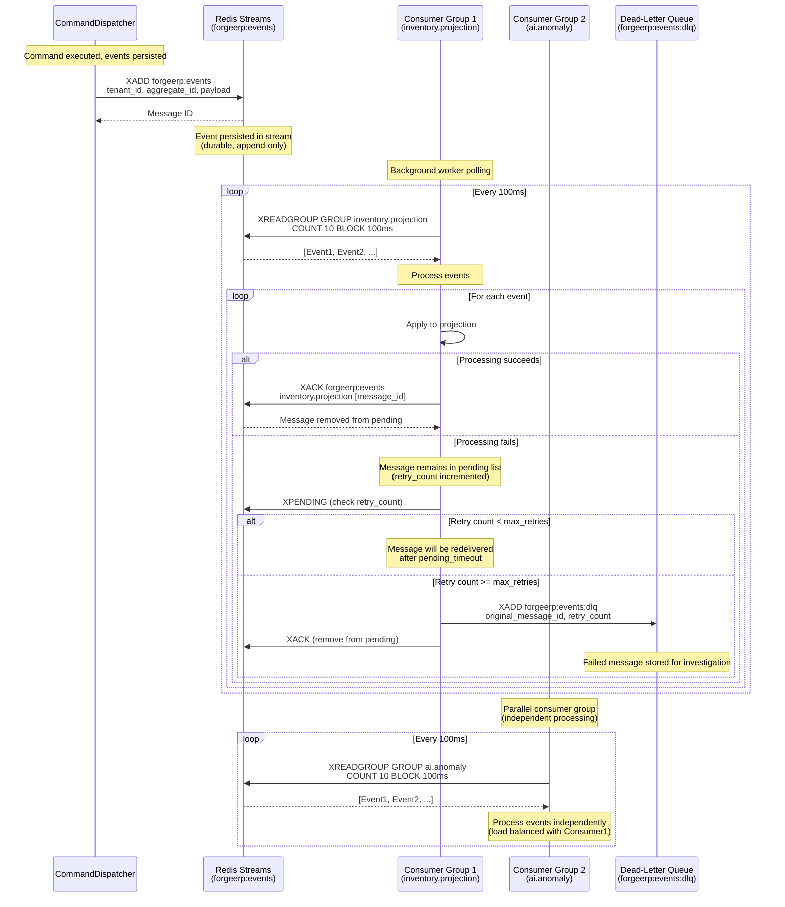

# Redis Streams: Durable Event Delivery

## Mermaid Diagram



## Key Concepts

### Consumer Groups

Each consumer group gets its own copy of all events:
- **inventory.projection**: Processes events for inventory read models
- **ai.anomaly**: Processes events for AI anomaly detection
- **default**: Fallback consumer group

Within a group, messages are load-balanced across consumers:
- **worker-1**, **worker-2**, etc. (multiple workers per group)
- Each message delivered to one consumer in the group

### At-Least-Once Delivery

Messages are redelivered if not acknowledged:
1. Consumer reads message → message moves to pending list
2. Consumer processes message
3. Consumer sends XACK → message removed from pending
4. If XACK never sent → message redelivered after `pending_timeout`

### Retry & Dead-Letter Strategy

**Retry Logic**:
- Messages remain in pending list if not ACK'd
- After `pending_timeout_ms` (default: 60s), messages are claimed by other consumers
- `retry_count` tracked in Redis metadata
- Max retries: 5 (configurable)

**Dead-Letter Queue**:
- Messages that fail `max_retries` times are sent to DLQ
- DLQ stores: `original_message_id`, `retry_count`, `failed_at`, `payload`
- Manual inspection and replay possible from DLQ

### Tenant-Aware Processing

Events are filtered by `tenant_id`:
- Consumer can specify `tenant_id` filter when subscribing
- Only events matching tenant are delivered
- Enables per-tenant processing workers

### Non-Blocking Command Pipeline

- **Publish**: XADD returns immediately (non-blocking)
- **Subscribe**: Background thread polls Redis (doesn't block command execution)
- **Acknowledge**: Async operation (doesn't block)

## Redis Streams Commands Used

- **XADD**: Append event to stream
- **XGROUP CREATE**: Create consumer group
- **XREADGROUP**: Read messages from consumer group
- **XACK**: Acknowledge processed messages
- **XPENDING**: Check pending (unacknowledged) messages
- **XCLAIM**: Claim idle pending messages (redelivery)

## Configuration

```rust
let bus = RedisStreamsEventBus::new(
    "redis://localhost:6379",
    Some("forgeerp:events".to_string()),      // Stream key
    Some("forgeerp:events:dlq".to_string()),  // DLQ key
)?;

// Subscribe with consumer group
let subscription = bus.subscribe_with_group(
    "inventory.projection",  // Consumer group name
    "worker-1",              // Consumer name
    Some(tenant_id),         // Optional tenant filter
);
```

## Production Considerations

1. **Acknowledgment Strategy**: Currently ACKs immediately after reading. For production, implement manual ACK after successful processing.
2. **Consumer Group Management**: Ensure consumer groups are created before workers start.
3. **Dead-Letter Monitoring**: Monitor DLQ size and investigate failed messages.
4. **Retry Tuning**: Adjust `pending_timeout_ms` and `max_retries` based on processing time.
5. **Scaling**: Add more consumers to a group for horizontal scaling (load balancing).

